# Week 2 实验报告

---

## 一、实验目的

1. **Linux 基本命令**：理解并掌握文件管理、权限管理、进程管理等基本命令；
2. **Python 和 C++ 开发环境配置**：安装与配置 Python3、GCC/G++ 编译器，编写并运行简单的程序；
3. **ROS1 Noetic 安装与配置**：安装并配置 ROS1 Noetic，启动 ROS Master、查看节点与话题；
4. **ROS 工作空间与功能包创建**：创建并配置 ROS 工作空间与功能包，编写 HelloWorld 节点；
5. **Turtlesim 控制**：通过键盘、rostopic、程序控制小乌龟；
6. **多乌龟控制与 Launch 文件使用**：通过 Launch 文件同时启动多个乌龟，使用命名空间控制每只乌龟，使用 rqt_graph 可视化通信关系

---

## 二、实验内容与步骤

### 任务 1：Linux 基础命令练习

### 1.1 创建、查看、删除文件

- 创建文件：

```bash
cd ~/Desktop
touch hello.txt

```

- 查看文件内容（空文件会没有内容）：

```bash
cat hello.txt

```

- 复制文件：

```bash
cp hello.txt hello_copy.txt

```

- 移动文件到新目录：

```bash
mkdir test_dir
mv hello.txt test_dir/

```

- 删除文件：

```bash
rm hello_copy.txt

```

- 删除目录：

```bash
rm -r test_dir

```

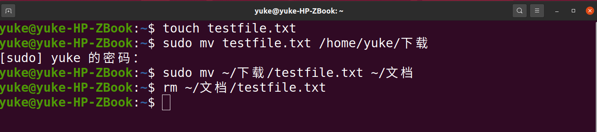

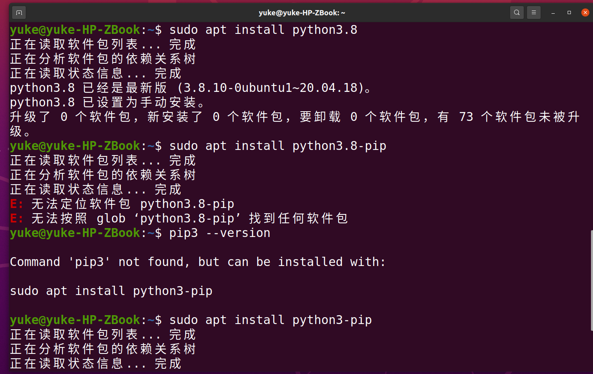

### 1.2 进程管理与终止进程

- 查看所有进程：

```bash
ps aux

```

- 搜索特定进程（例如 Python）：

```bash
ps aux | grep python

```

- 杀死进程（替换 `<PID>` 为实际进程号）：

```bash
kill -9 <PID>

```

---

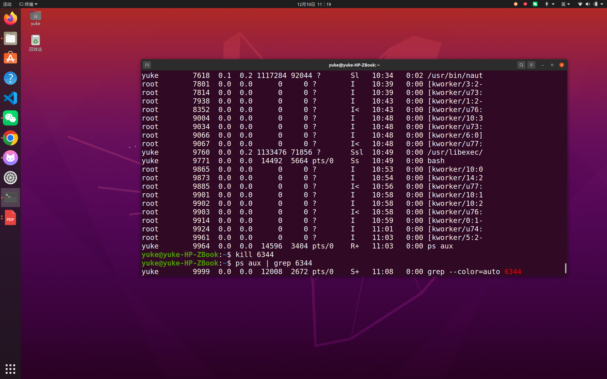

### 任务 2：Python 与 C++ 编程练习

### 2.1 Python HelloWorld

1. 创建 Python 文件 `hello.py`：

```bash
cd ~/Desktop
touch hello.py
gedit hello.py

```

2.写入以下代码：

```python
print("Hello ROS from Python!")

```

3.运行：

```bash
python3 hello.py

```

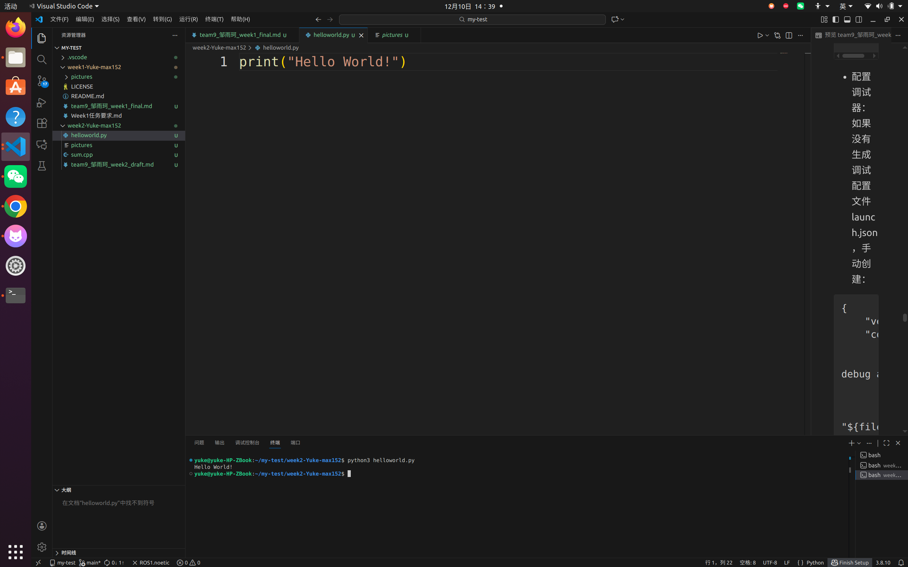

### 2.2 C++ 程序编写与编译

1. 创建 C++ 文件 `sum.cpp`：

```bash
cd ~/Desktop
touch sum.cpp
gedit sum.cpp

```

2.写入以下代码：

```cpp
#include <iostream>
using namespace std;

int main() {
    int a, b;
    cout << "Enter two numbers: ";
    cin >> a >> b;
    cout << "Sum = " << a + b << endl;
    return 0;
}

```

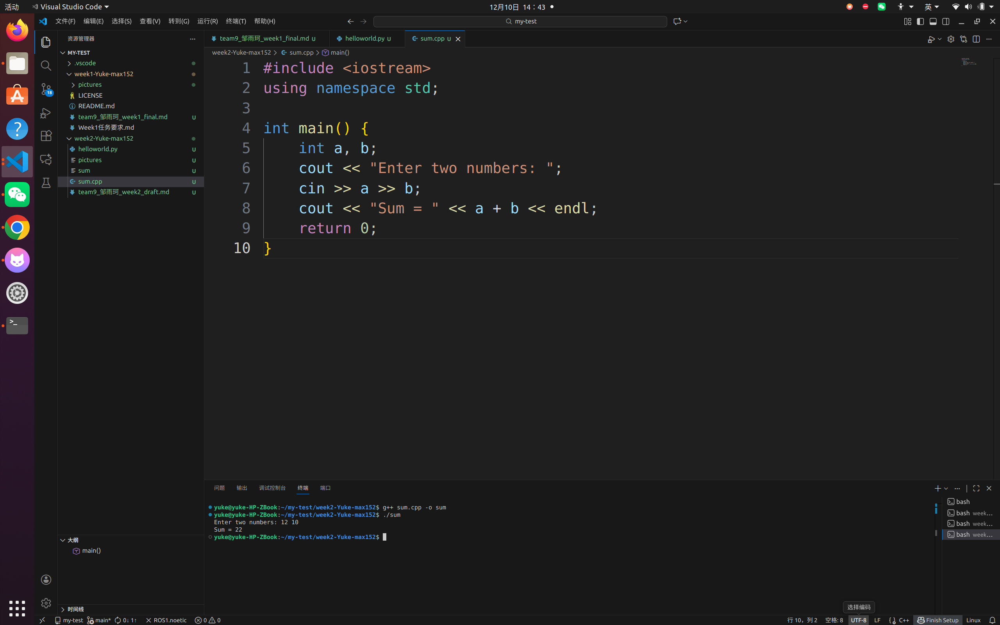

1. 编译程序：

```bash
g++ sum.cpp -o sum

```

4.运行程序：

```bash
./sum

```

### 2.3 VSCode 调试环境准备

1. 打开 VSCode：

```bash
code .

```

2.安装必要的插件：`C/C++`、`Python`、`CMake`、`ROS`。

3.创建 `launch.json`，选择 C++ 或 Python 进行调试。

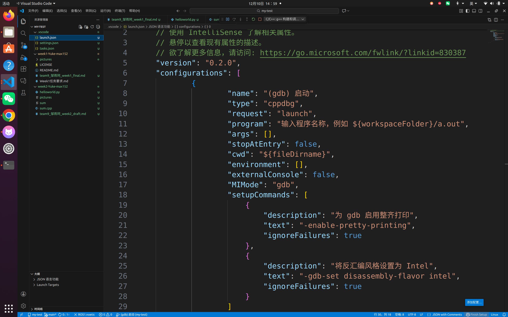

---

### 任务 3：ROS1 Noetic 安装验证

### 3.1 启动 ROS Master

1. 在终端执行：

```bash
roscore

```

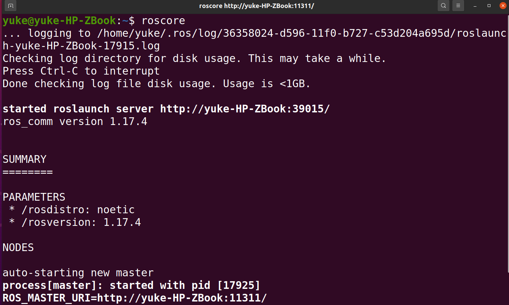

### 3.2 查看 ROS 节点

1. 在新终端执行：

```bash
rosnode list

```

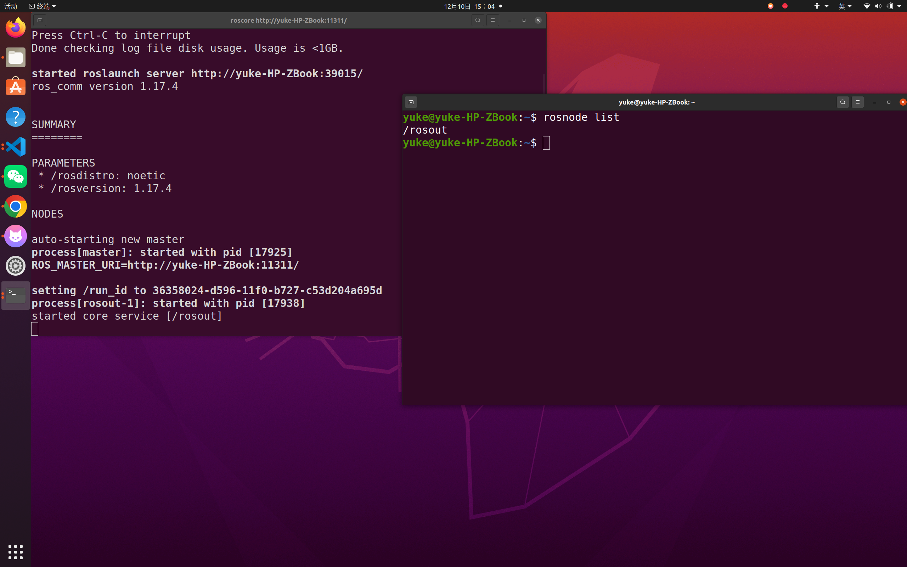

### 3.3 查看 ROS 环境变量

1. 执行以下命令查看 ROS 环境变量：

```bash
echo $ROS_DISTRO
echo $ROS_PACKAGE_PATH

```

---

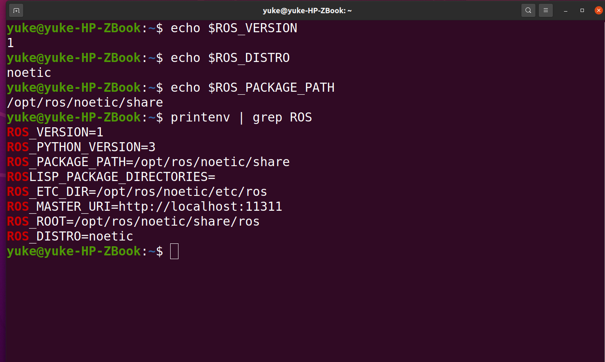

### 任务 4：ROS 工作空间与功能包

### 4.1 创建 catkin 工作空间

1. 创建工作空间并编译：

```bash
mkdir -p ~/catkin_ws/src
cd ~/catkin_ws
catkin_make

```

2.配置环境变量：

```bash
source devel/setup.bash

```

### 4.2 创建功能包

1. 创建功能包：

```bash
cd ~/catkin_ws/src
catkin_create_pkg beginner_tutorials roscpp std_msgs geometry_msgs

```

2.编译工作空间：

```bash
cd ~/catkin_ws
catkin_make
source devel/setup.bash

```

### 4.3 编写 HelloWorld 节点（C++ 示例）

1. 创建 C++ 文件：

```bash
cd ~/catkin_ws/src/beginner_tutorials/src
touch hello_ros.cpp
gedit hello_ros.cpp

```

2.编写代码：

```cpp
#include <ros/ros.h>

int main(int argc, char** argv)
{
    ros::init(argc, argv, "hello_cpp");
    ros::NodeHandle nh;
    ROS_INFO("Hello ROS from C++!");
    return 0;
}

```

3.修改 CMakeLists.txt 文件：

```
add_executable(hello_ros src/hello_ros.cpp)
target_link_libraries(hello_ros ${catkin_LIBRARIES})

```

1. 编译并运行：

```bash
catkin_make
rosrun beginner_tutorials hello_ros

```

---

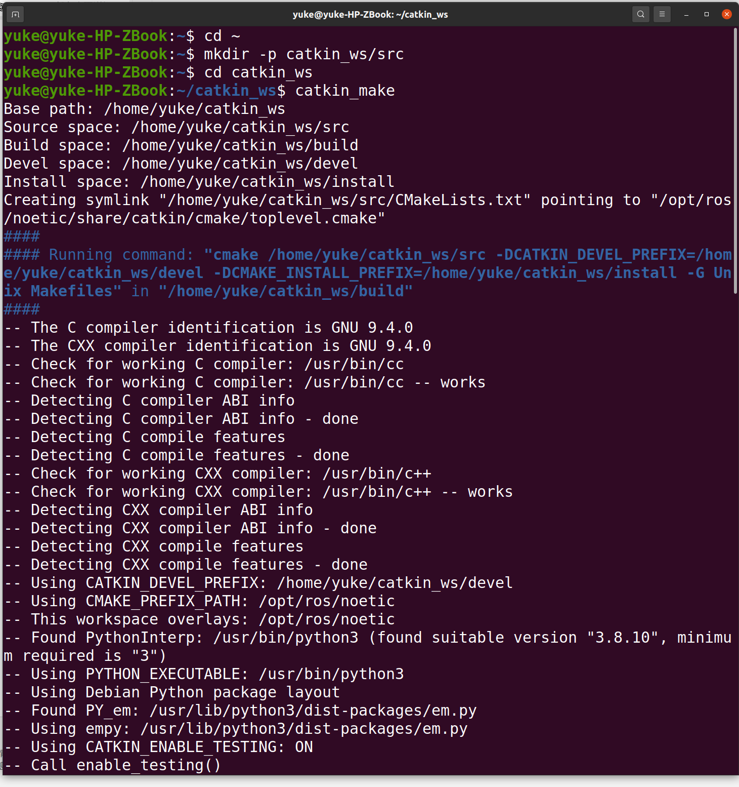

### 任务 5：Turtlesim 小乌龟模块

### 5.1 启动 turtlesim

1. 启动 `turtlesim` 仿真工具：

```bash
rosrun turtlesim turtlesim_node

```

2.启动键盘控制：

```bash
rosrun turtlesim turtle_teleop_key

```

### 5.2 使用 rostopic 控制

1. 发布速度控制：

```bash
rostopic pub /turtle1/cmd_vel geometry_msgs/Twist "{linear: {x: 2.0}, angular: {z: 1.5}}"

```

[](https://www.notion.so)

### 5.3 程序控制小乌龟

1. 创建 C++ 程序控制小乌龟画圆：

```bash
cd ~/catkin_ws/src/beginner_tutorials/src
touch turtle_circle.cpp
gedit turtle_circle.cpp

```

2.编写代码：

```cpp
#include <ros/ros.h>
#include <geometry_msgs/Twist.h>  // 发布乌龟速度需要 Twist 消息类型

int main(int argc, char** argv)
{
    ros::init(argc, argv, "turtle_circle_cpp");
    ros::NodeHandle nh;
    ros::Publisher pub = nh.advertise<geometry_msgs::Twist>("/turtle1/cmd_vel", 10);
    ros::Rate rate(10);  // 设置 10Hz 发布频率
    geometry_msgs::Twist msg;
    msg.linear.x = 2.0;   // 乌龟向前运动
    msg.angular.z = 2.0;  // 同时旋转 → 组合成画圆

    while (ros::ok())四、实验结果分析
成功通过 roscore 启动 ROS Master，并验证了 ROS 环境变量。
使用 rostopic 控制了小乌龟运动，成功实现了直线、旋转和画圆。
使用 rosservice 创建了第二只乌龟，并通过 rostopic 实现了独立控制。
成功使用 rqt_graph 和 rqt_plot 可视化了通信关系图和速度图。
四、实验结果分析
成功通过 roscore 启动 ROS Master，并验证了 ROS 环境变量。
使用 rostopic 控制了小乌龟运动，成功实现了直线、旋转和画圆。
使用 rosservice 创建了第二只乌龟，并通过 rostopic 实现了独立控制。
成功使用 rqt_graph 和 rqt_plot 可视化了通信关系图和速度图。

    {
        pub.publish(msg);  // 每次循环都发布指令
        rate.sleep();
    }
    return 0;
}

```

3.编译并运行：

```bash
catkin_make
rosrun beginner_tutorials turtle_circle


```

---

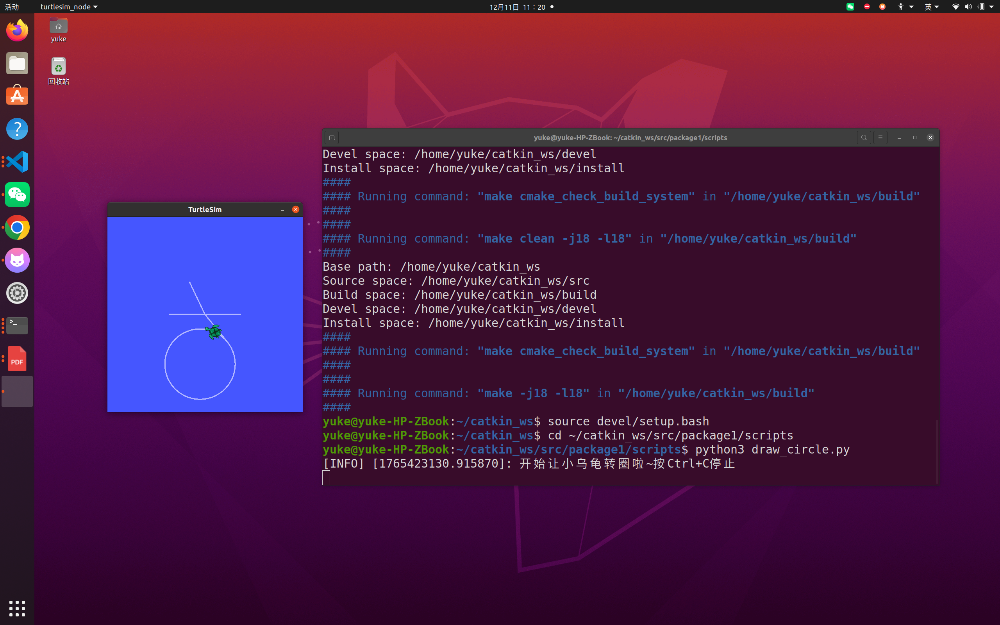

### 任务 6：多乌龟控制与 Launch 文件

### 6.1 创建一个 Launch 文件

1. 创建并编辑 `multi_turtles.launch` 文件：

```bash
cd ~/catkin_ws/src/beginner_tutorials/launch
gedit multi_turtles.launch

```

2.写入以下内容：

```xml
<launch>
    <node pkg="turtlesim" type="turtlesim_node" name="turtlesim"/>
</launch>
四、实验结果分析
成功通过 roscore 启动 ROS Master，并验证了 ROS 环境变量。
使用 rostopic 控制了小乌龟运动，成功实现了直线、旋转和画圆。
使用 rosservice 创建了第二只乌龟，并通过 rostopic 实现了独立控制。
成功使用 rqt_graph 和 rqt_plot 可视化了通信关系图和速度图。

```

### 6.2 启动 turtlesim 并创建第二只乌龟

1. 启动第一个乌龟：

```bash
roslaunch beginner_tutorials multi_turtles.launch

```

2.创建第二只乌龟：

```bash
rosservice call /spawn 5.0 5.0 0.0 "turtle2"

```

### 6.3 查看话题

查看所有话题：

```bash
rostopic list

```

### 6.4 控制两只乌龟

使用 `rostopic` 控制两只乌龟的运动：

```bash
rostopic pub -r 10 /turtle1/cmd_vel geometry_msgs/Twist "{linear: {x: 2.0}, angular: {z: 1.0}}"
rostopic pub -r 10 /turtle2/cmd_vel geometry_msgs/Twist "{linear: {x: 1.0}, angular: {z: -1.0}}"

```

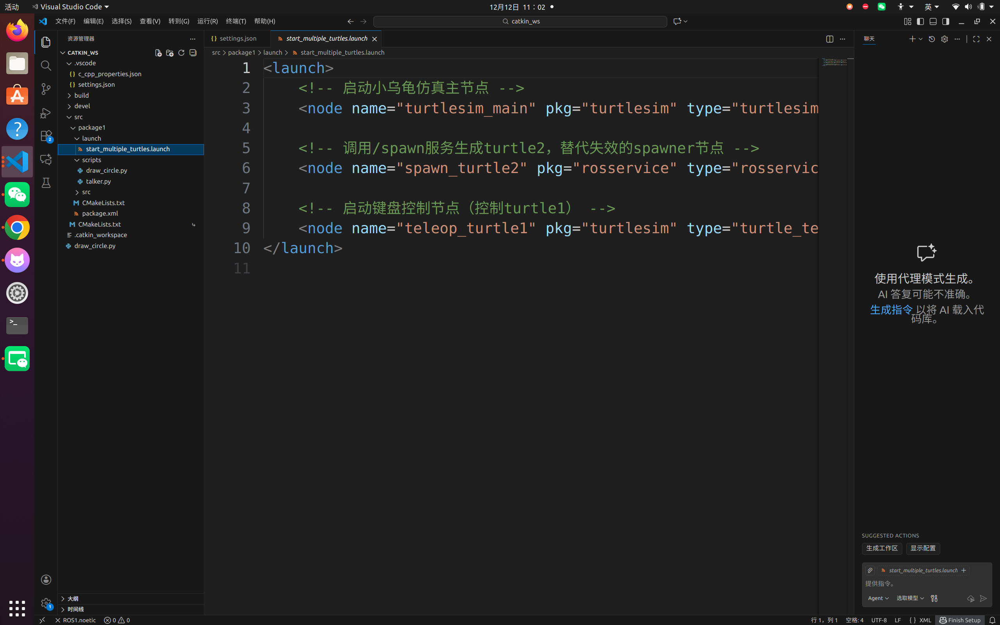

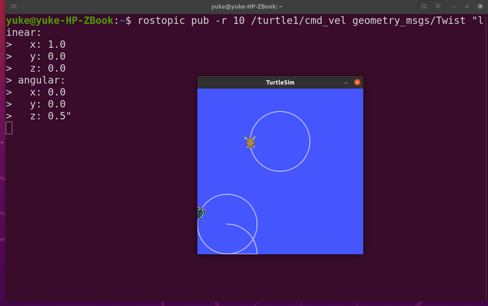

### 6.5 使用 `rqt_graph` 查看通信关系

```bash
rqt_graph

```

### 6.6 使用 `rqt_plot` 查看速度图

```bash
rqt_plot /turtle1/cmd_vel/linear/x
rqt_plot /turtle2/cmd_vel/angular/z

```

---

---

## 三、问题与解决过程总结

### 问题

1. **路径错误**：多次出现路径错误，导致 ROS 找不到 `launch` 文件。
2. **spawner 节点问题**：在 ROS Noetic 中，`spawner` 节点被移除，需使用 `/spawn` 服务。

### 解决过程

1. 修改了 `launch` 文件路径，确保正确。
2. 使用 ROS Noetic 推荐的 `/spawn` 服务替代 `spawner` 节点。

---

## 四、实验总结

通过本次实验，我掌握了 ROS1 Noetic 的基础操作，还学会了如何通过命名空间控制多只小乌龟，同时通过 Python 和 C++ 程序控制小乌龟的运动轨迹。通过本次实验，我更加深入地理解了 ROS 的节点通信机制、话题控制及 ROS 编程的基本流程。
